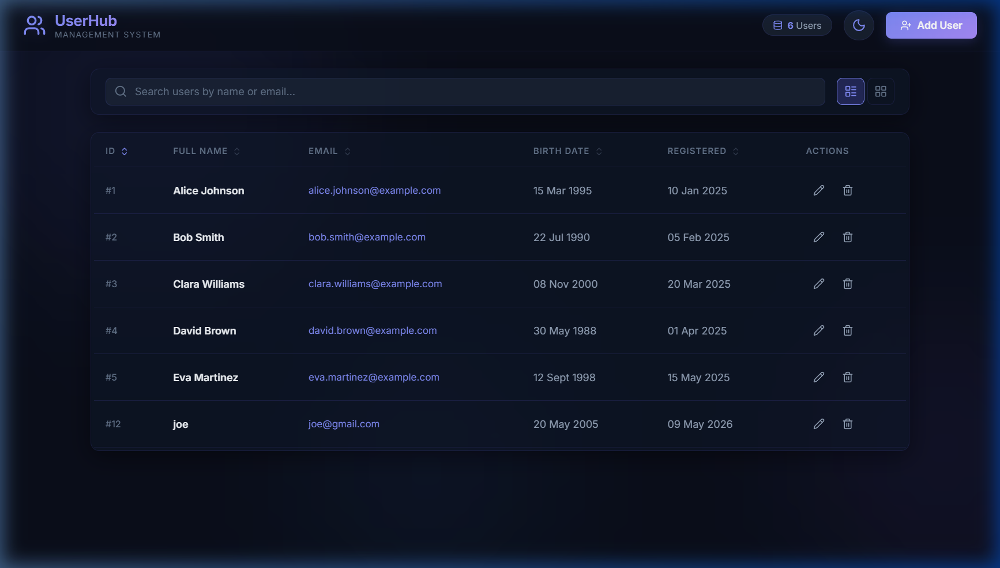
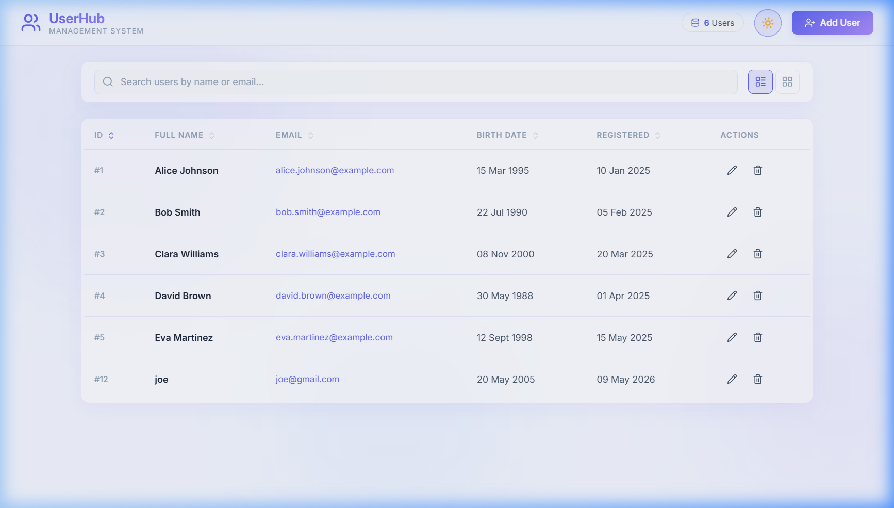
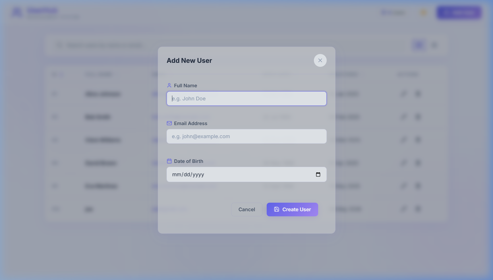
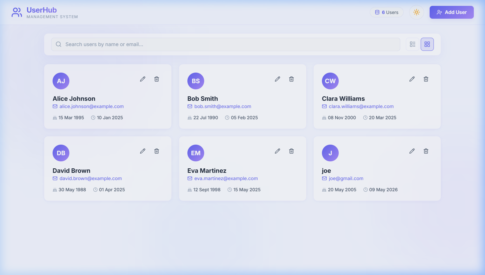

<p align="center">
  
</p>

<h1 align="center">UserHub — User Management System</h1>

<p align="center">
  <strong>A modern, full-stack web application for managing users — built with ASP.NET Core 9, Entity Framework Core, SQLite, and a custom SPA frontend.</strong>
</p>

<p align="center">
  
  
  
  
  
</p>

<p align="center">
  <a href="#-features">Features</a> •
  <a href="#-screenshots">Screenshots</a> •
  <a href="#-architecture">Architecture</a> •
  <a href="#-tech-stack">Tech Stack</a> •
  <a href="#-getting-started">Getting Started</a> •
  <a href="#-api-reference">API Reference</a> •
  <a href="#-project-structure">Project Structure</a>
</p>

---

## ✨ Features

| Category | Feature | Description |
|----------|---------|-------------|
| 🔄 **CRUD** | Full CRUD Operations | Create, Read, Update, and Delete users with full validation |
| 🌐 **API** | RESTful Architecture | Clean API with proper HTTP verbs, status codes & error handling |
| 🎨 **Themes** | Dark / Light Mode | Premium glassmorphism UI with animated theme toggle |
| 📊 **Views** | Dual View Modes | Seamlessly switch between table and card layouts |
| 🔍 **Search** | Real-time Filtering | Instant client-side search by name or email |
| ↕️ **Sorting** | Column Sorting | Click any column header to sort ascending/descending |
| ✅ **Validation** | Client + Server | Dual-layer validation on both frontend and backend |
| 🔔 **Toasts** | Notifications | Animated toast notifications for all user actions |
| 📱 **Responsive** | Mobile-Ready | Fully responsive from mobile to widescreen |
| 💫 **Animations** | Micro-interactions | Smooth transitions, animated blobs, and hover effects |
| 🗃️ **Seeding** | Sample Data | Ships with 5 pre-seeded users for instant demo |
| 🔁 **Duplicate Check** | Email Uniqueness | Server-enforced unique email constraint |

---

## 📸 Screenshots

<details>
<summary><strong>🌙 Dark Theme — Table View</strong> (click to expand)</summary>
<br/>
<p align="center">
  
</p>
</details>

<details>
<summary><strong>☀️ Light Theme — Table View</strong> (click to expand)</summary>
<br/>
<p align="center">
  
</p>
</details>

<details>
<summary><strong>➕ Add / Edit User Modal</strong> (click to expand)</summary>
<br/>
<p align="center">
  
</p>
</details>

<details>
<summary><strong>🃏 Card View Layout</strong> (click to expand)</summary>
<br/>
<p align="center">
  
</p>
</details>

---

## 🏗️ Architecture

### High-Level System Architecture

```
┌─────────────────────────────────────────────────────────────────────┐
│                         CLIENT (Browser)                            │
│  ┌───────────┐  ┌───────────────┐  ┌──────────────────────────┐    │
│  │ index.html│  │  styles.css   │  │        app.js            │    │
│  │  (SPA)    │  │ (Dark/Light)  │  │  (Fetch API + DOM Mgmt)  │    │
│  └───────────┘  └───────────────┘  └──────────┬───────────────┘    │
│                                                │                    │
└────────────────────────────────────────────────┼────────────────────┘
                                                 │  HTTP / JSON
                                                 ▼
┌─────────────────────────────────────────────────────────────────────┐
│                    ASP.NET Core 9  (Kestrel)                        │
│                                                                     │
│  ┌────────────────────── Middleware Pipeline ─────────────────────┐ │
│  │  CORS  →  Static Files  →  Routing  →  Authorization          │ │
│  └───────────────────────────────────────────────────────────────┘ │
│                                                                     │
│  ┌─────────────────────────────────────────────────────────────┐   │
│  │               UsersController  [ApiController]              │   │
│  │                  /api/users/*                                │   │
│  │  ┌──────┐ ┌──────┐ ┌──────┐ ┌──────┐ ┌──────────┐         │   │
│  │  │ GET  │ │GET/id│ │ POST │ │ PUT  │ │ DELETE   │          │   │
│  │  │ all  │ │      │ │create│ │update│ │          │          │   │
│  │  └──────┘ └──────┘ └──────┘ └──────┘ └──────────┘         │   │
│  └──────────────────────────┬──────────────────────────────────┘   │
│                             │                                       │
│  ┌──────────────────────────▼──────────────────────────────────┐   │
│  │             Entity Framework Core 9  (ORM)                  │   │
│  │               AppDbContext + User Entity                    │   │
│  │          (LINQ Queries, Change Tracking, Migrations)        │   │
│  └──────────────────────────┬──────────────────────────────────┘   │
│                             │                                       │
└─────────────────────────────┼───────────────────────────────────────┘
                              │  ADO.NET / SQLite Provider
                              ▼
                    ┌────────────────────┐
                    │   SQLite Database  │
                    │    (users.db)      │
                    │                    │
                    │  ┌──────────────┐  │
                    │  │  Users Table │  │
                    │  └──────────────┘  │
                    └────────────────────┘
```

### Request / Response Flow

```
  Browser                        ASP.NET Core                    SQLite
    │                                │                              │
    │  1. HTTP Request (JSON)        │                              │
    │ ──────────────────────────────>│                              │
    │                                │                              │
    │                 2. Middleware   │                              │
    │                    Pipeline    │                              │
    │                    (CORS,      │                              │
    │                     Auth)      │                              │
    │                                │                              │
    │                 3. Route to    │                              │
    │                    Controller  │                              │
    │                                │                              │
    │                 4. Model       │                              │
    │                    Validation  │                              │
    │                                │  5. EF Core LINQ Query      │
    │                                │ ───────────────────────────> │
    │                                │                              │
    │                                │  6. SQL Result               │
    │                                │ <─ ─ ─ ─ ─ ─ ─ ─ ─ ─ ─ ─ ─│
    │                                │                              │
    │                 7. Serialize   │                              │
    │                    to JSON     │                              │
    │                                │                              │
    │  8. HTTP Response (JSON)       │                              │
    │ <──────────────────────────────│                              │
    │                                │                              │
    │  9. Update DOM                 │                              │
    │     (Render UI)                │                              │
    │                                │                              │
```

### Entity Relationship Diagram

```
┌──────────────────────────────────────────────────────────────┐
│                         Users                                 │
├──────────────────────────────────────────────────────────────┤
│  PK │ Id               │ INTEGER  │ Auto-increment           │
│     │ FullName          │ TEXT     │ NOT NULL, max 100 chars  │
│     │ Email             │ TEXT     │ NOT NULL, UNIQUE, max 150│
│     │ BirthDate         │ TEXT     │ NOT NULL (ISO 8601)      │
│     │ RegistrationDate  │ TEXT     │ NOT NULL (UTC DateTime)  │
└──────────────────────────────────────────────────────────────┘

Constraints:
  • PRIMARY KEY (Id)
  • UNIQUE INDEX on Email
  • Required: FullName, Email, BirthDate
  • FullName length: 2–100 characters
  • Email validated with [EmailAddress] annotation
```

### Frontend Component Architecture

```
index.html (SPA Shell)
├── Header
│   ├── Logo + Branding
│   ├── Stats Bar (user count)
│   ├── Theme Toggle (dark/light)
│   └── Add User Button
│
├── Toolbar
│   ├── Search Input (real-time filter)
│   └── View Toggles (table / card)
│
├── Content Area
│   ├── Loading Spinner
│   ├── Empty State (zero users)
│   ├── Table View (sortable columns)
│   └── Card View (responsive grid)
│
├── User Modal (Add / Edit)
│   └── Form with client-side validation
│
├── Delete Confirmation Modal
│
└── Toast Container (notifications)
```

---

## 🛠️ Tech Stack

| Layer | Technology | Purpose |
|-------|-----------|---------|
| **Runtime** | [.NET 9](https://dotnet.microsoft.com/) | Cross-platform application framework |
| **Backend** | [ASP.NET Core 9 MVC](https://learn.microsoft.com/aspnet/core/) | RESTful API with controller-based routing |
| **ORM** | [Entity Framework Core 9](https://learn.microsoft.com/ef/core/) | Object-relational mapping & migrations |
| **Database** | [SQLite](https://www.sqlite.org/) | Embedded relational database (zero config) |
| **Frontend** | HTML5, CSS3, Vanilla JS | Custom SPA with no framework dependency |
| **Icons** | [Lucide Icons](https://lucide.dev/) | Modern, consistent SVG icon set (CDN) |
| **Typography** | [Inter](https://fonts.google.com/specimen/Inter) | Premium variable font via Google Fonts |

### NuGet Packages

| Package | Version | Purpose |
|---------|---------|---------|
| `Microsoft.EntityFrameworkCore.Sqlite` | 9.0.* | SQLite database provider for EF Core |
| `Microsoft.EntityFrameworkCore.Design` | 9.0.* | Design-time support for EF migrations |
| `Microsoft.AspNetCore.OpenApi` | 9.0.15 | OpenAPI metadata for endpoint discovery |

---

## 🚀 Getting Started

### Prerequisites

| Requirement | Version | Download |
|-------------|---------|----------|
| .NET SDK | 9.0+ | [Download](https://dotnet.microsoft.com/download/dotnet/9.0) |
| Git | Latest | [Download](https://git-scm.com/downloads) |

### Installation & Setup

```bash
# 1. Clone the repository
git clone https://github.com/<your-username>/UserHub.git
cd UserHub

# 2. Restore NuGet packages
dotnet restore

# 3. Apply database migrations (creates users.db with seed data)
dotnet ef database update

# 4. Run the application
dotnet run
```

The application will start at **http://localhost:5000** (or the port shown in the terminal output).

> [!NOTE]
> The SQLite database (`users.db`) is created **automatically** on first run with **5 sample users** pre-seeded. No additional database setup is required.

### EF Core CLI (Optional)

```bash
# Install the EF Core CLI tool (if not already installed)
dotnet tool install --global dotnet-ef

# Create a new migration
dotnet ef migrations add <MigrationName>

# Update database to latest migration
dotnet ef database update

# Remove the last migration (if not applied)
dotnet ef migrations remove
```

---

## 📡 API Reference

**Base URL:** `http://localhost:5000/api/users`

### Endpoints

| # | Method | Endpoint | Description | Success | Error |
|---|--------|----------|-------------|---------|-------|
| 1 | `GET` | `/api/users` | Retrieve all users (sorted by registration date DESC) | `200 OK` | — |
| 2 | `GET` | `/api/users/{id}` | Retrieve a specific user by ID | `200 OK` | `404 Not Found` |
| 3 | `POST` | `/api/users` | Create a new user | `201 Created` | `400 Bad Request` / `409 Conflict` |
| 4 | `PUT` | `/api/users/{id}` | Update an existing user | `200 OK` | `400` / `404` / `409` |
| 5 | `DELETE` | `/api/users/{id}` | Delete a user | `204 No Content` | `404 Not Found` |

### Request / Response Examples

<details>
<summary><strong>POST /api/users</strong> — Create a new user</summary>

**Request:**
```http
POST /api/users HTTP/1.1
Content-Type: application/json

{
  "fullName": "Alice Johnson",
  "email": "alice.johnson@example.com",
  "birthDate": "1995-03-15"
}
```

**Response:** `201 Created`
```json
{
  "id": 1,
  "fullName": "Alice Johnson",
  "email": "alice.johnson@example.com",
  "birthDate": "1995-03-15T00:00:00",
  "registrationDate": "2026-05-22T14:30:00Z"
}
```

**Error:** `409 Conflict`
```json
{
  "message": "A user with this email already exists."
}
```
</details>

<details>
<summary><strong>PUT /api/users/{id}</strong> — Update an existing user</summary>

**Request:**
```http
PUT /api/users/1 HTTP/1.1
Content-Type: application/json

{
  "fullName": "Alice J. Updated",
  "email": "alice.updated@example.com",
  "birthDate": "1995-03-15"
}
```

**Response:** `200 OK`
```json
{
  "id": 1,
  "fullName": "Alice J. Updated",
  "email": "alice.updated@example.com",
  "birthDate": "1995-03-15T00:00:00",
  "registrationDate": "2025-01-10T09:00:00Z"
}
```
</details>

<details>
<summary><strong>GET /api/users</strong> — List all users</summary>

**Response:** `200 OK`
```json
[
  {
    "id": 5,
    "fullName": "Eva Martinez",
    "email": "eva.martinez@example.com",
    "birthDate": "1998-09-12T00:00:00",
    "registrationDate": "2025-05-15T16:00:00Z"
  },
  {
    "id": 4,
    "fullName": "David Brown",
    "email": "david.brown@example.com",
    "birthDate": "1988-05-30T00:00:00",
    "registrationDate": "2025-04-01T08:45:00Z"
  }
]
```
</details>

### User Model Schema

```json
{
  "id":               "integer  — auto-generated primary key",
  "fullName":         "string   — required, 2–100 characters",
  "email":            "string   — required, valid email, unique",
  "birthDate":        "string   — required, ISO 8601 date",
  "registrationDate": "string   — auto-set on creation (UTC)"
}
```

### Validation Rules

| Field | Constraint | Error Message |
|-------|-----------|---------------|
| `fullName` | Required, 2–100 chars | "Full name is required." / "Full name must be between 2 and 100 characters." |
| `email` | Required, valid email, ≤150 chars, unique | "Email is required." / "A valid email address is required." |
| `birthDate` | Required, valid date | "Birth date is required." |

---

## 📁 Project Structure

```
UserHub/
│
├── 📂 Controllers/
│   └── UsersController.cs          # RESTful API controller — 5 CRUD endpoints
│
├── 📂 Data/
│   └── AppDbContext.cs             # EF Core DbContext, entity config & seed data
│
├── 📂 Models/
│   └── User.cs                    # User entity with data annotation validation
│
├── 📂 Migrations/
│   ├── *_InitialCreate.cs         # Initial schema migration
│   └── AppDbContextModelSnapshot   # EF Core model snapshot
│
├── 📂 wwwroot/                     # Static frontend (served by Kestrel)
│   ├── index.html                  # SPA shell — all UI components
│   ├── styles.css                  # Premium CSS — dark/light themes, glassmorphism
│   └── app.js                     # Client logic — Fetch API, validation, DOM management
│
├── 📂 docs/
│   └── 📂 screenshots/            # Application screenshots for documentation
│
├── Program.cs                      # App bootstrap — services, middleware, DB migration
├── appsettings.json                # Configuration (logging, allowed hosts)
├── UserManagement.csproj           # .NET project file & NuGet dependencies
├── FullStack_Project.sln           # Visual Studio solution file
├── .gitignore                      # Git ignore rules
├── LICENSE                         # MIT License
└── README.md                       # This file
```

---

## ⚙️ Configuration

### Connection String

The default SQLite connection string is configured in `Program.cs`:

```csharp
options.UseSqlite(builder.Configuration.GetConnectionString("DefaultConnection")
    ?? "Data Source=users.db");
```

To override, add to `appsettings.json`:

```json
{
  "ConnectionStrings": {
    "DefaultConnection": "Data Source=users.db"
  }
}
```

### CORS Policy

CORS is configured to allow all origins during development:

```csharp
policy.AllowAnyOrigin()
      .AllowAnyMethod()
      .AllowAnyHeader();
```

> [!WARNING]
> For production, restrict CORS to specific trusted origins.

---

## 🧪 Testing the API

You can test the API using any HTTP client:

<details>
<summary><strong>Using cURL</strong></summary>

```bash
# List all users
curl -s http://localhost:5000/api/users | jq

# Create a user
curl -X POST http://localhost:5000/api/users \
  -H "Content-Type: application/json" \
  -d '{"fullName":"Test User","email":"test@example.com","birthDate":"2000-01-15"}'

# Update a user
curl -X PUT http://localhost:5000/api/users/1 \
  -H "Content-Type: application/json" \
  -d '{"fullName":"Updated Name","email":"updated@example.com","birthDate":"2000-01-15"}'

# Delete a user
curl -X DELETE http://localhost:5000/api/users/1
```
</details>

<details>
<summary><strong>Using the built-in .http file</strong></summary>

Open `UserManagement.http` in Visual Studio / VS Code with the REST Client extension.

</details>

---

## 🗺️ Roadmap & Known Limitations

| Status | Item | Description |
|--------|------|-------------|
| ⚠️ | Authentication | No auth — production apps should implement JWT or cookie-based auth |
| ⚠️ | Pagination | All users loaded at once — add server-side pagination for large datasets |
| ⚠️ | SQLite | Suitable for dev/demo — consider PostgreSQL or SQL Server for production |
| 💡 | Role-based Access | Add admin/user roles with policy-based authorization |
| 💡 | Export | CSV/Excel export functionality |
| 💡 | Audit Logging | Track create/update/delete operations with timestamps |
| 💡 | Docker | Add `Dockerfile` and `docker-compose.yml` for containerized deployment |

---

## 🤝 Contributing

Contributions are welcome! Please follow these steps:

1. **Fork** the repository
2. **Create** a feature branch (`git checkout -b feature/amazing-feature`)
3. **Commit** your changes (`git commit -m 'Add amazing feature'`)
4. **Push** to the branch (`git push origin feature/amazing-feature`)
5. **Open** a Pull Request

---

## 📄 License

This project is licensed under the **MIT License** — see the [LICENSE](LICENSE) file for details.

---

## 👤 Author

**Rehan**

Built as a university assignment for the **Full Stack Development** course (2025/26).

---

<p align="center">
  <sub>Built with ❤️ using ASP.NET Core 9 + Vanilla JavaScript</sub>
</p>
